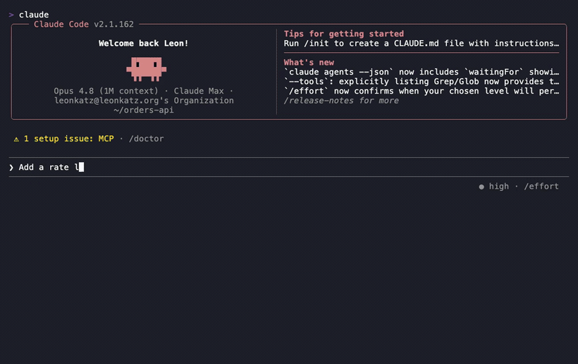

# REKOL

[](LICENSE)
[](https://github.com/rekol-io/rekol/actions/workflows/ci.yml)
[](https://github.com/rekol-io/rekol/releases)

> **Local-first memory for Claude Code** — the assistant you already use. A
> drop-in memory layer: no API key, runs on your machine, and Claude Code uses
> it automatically. Your memory is markdown in a folder you own.



REKOL works anywhere Claude Code runs — the terminal, your IDE (VS Code or
JetBrains), or the Claude Desktop app. It runs on macOS and Linux.

## Why

You don't run memory commands — you just work, and the assistant already has
your context and uses it. REKOL's specific corner:

- **No API key, fully local.** Embeddings (BAAI `bge-small`) and vector search
  (`sqlite-vec`) run on your machine. No account, no key, no telemetry — the
  memory layer runs entirely on your hardware.
- **A drop-in *layer*, not a new app.** REKOL plugs into Claude Code, the
  assistant you already use — no agent to adopt, no tool to switch.
- **Memory that surfaces itself.** A layered model (`always / when / topics /
  knowledge`) injects the right context at the start of each session, and the
  assistant pulls in more as it works — it just *knows*, instead of being told
  to look.

Your memory is plain **markdown you own** (Obsidian, grep, git), and REKOL
searches your past **session transcripts** alongside your curated notes — these
are table stakes done well, not the headline.

## Quickstart (macOS & Linux)

**1. Install** — one command:
```bash
git clone https://github.com/rekol-io/rekol && cd rekol && ./install.sh
```
That's the whole setup: it installs the `rekol` CLI, wires it into Claude Code, and
**indexes your existing Claude Code history** — so your assistant has ambient memory and your
past sessions are searchable **right away**. (Answer the memory-folder prompt, or pre-set
`REKOL_HOME` — see options below.)

**2. Teach it your project (recommended)** — in Claude Code, say **"set up my rekol memory."**
It distills durable `always` / `when` / `topics` memories from your history for you to review —
you approve what's kept. REKOL already works without this (install indexed your history); run it
whenever.

<details>
<summary><strong>Install options &amp; configuration</strong></summary>

**Choose your memory folder up front** (skips the prompt):
```bash
export REKOL_HOME="$HOME/rekol-memory"   # any folder you own
```
Sync it via Dropbox/iCloud/git/Syncthing or keep it local — the index lives in a local cache
*outside* your memory folder, so syncing your memory never syncs the index.

**Durable transcript archive** — rekol keeps a **local** copy of your sessions so your memory
survives even if Claude Code rotates its transcripts. It lives under `~/.local/share/rekol/archive`,
is never uploaded, and is excluded from sync by default. Turn it off with `--no-archive` (or
`archive_enabled: false` in `rekol.config.yaml`); relocate it with `--archive-dir`; exclude
sensitive projects with `exclude_paths` / `.rekolignore`.

**`./install.sh` flags** (all optional):

- `--dry-run` — print every action without executing it.
- `--no-hook` — skip the Claude Code SessionStart/hook wiring (settings.json).
- `--no-skill` — skip installing the `rekol`/`memory` Claude Code skill.
- `--no-shellrc` — skip the shell-rc edits (PATH + `REKOL_HOME` export) — written to
  `~/.zshrc` for zsh, or `~/.bashrc`/`~/.bash_profile` for bash, per your login shell.
- `--test-mode` — shorthand for `--no-hook --no-skill --no-shellrc`.
- `--tools-home PATH` — override the venv + tools home (default `~/.local/share/rekol`).
- `--bin-dir PATH` — override where the `rekol` shim lives (default `~/bin`).
- `--migrate` — opt in to importing legacy `~/.claude/projects/*/memory/` content.
- `--no-archive` — disable the durable transcript archive (seeds `archive_enabled: false`).
- `--archive-dir PATH` — set the durable archive location (default `~/.local/share/rekol/archive`).
- `--help` — print usage and exit.
</details>

<details>
<summary><strong>Install failed, or search seems degraded? Check prerequisites</strong></summary>

- macOS or Linux; **Claude Code** installed (REKOL is a memory layer for it).
- **Python ≥3.11 whose `sqlite3` has `enable_load_extension`** — required for
  `sqlite-vec` vector search. macOS's *system* python and the python.org
  installer ship this **disabled**, which degrades search to a keyword/numpy
  fallback. Reliable options (`install.sh` auto-detects and prefers these):
  - `brew install uv && uv python install 3.12` — uv's Python always has the
    extension; the installer picks it up automatically.
  - or `brew install python` — Homebrew's default `python@3` is built with extensions.
- **jq** (optional) — only for automatic `~/.claude/settings.json` hook wiring;
  without it the installer prints the snippet to merge by hand.

If no suitable interpreter is found, `install.sh` stops early with the exact fix
rather than installing a degraded setup.
</details>

*If REKOL is useful to you, a ⭐ helps others find it.*

## Bring in your history

Install already **backfilled your existing Claude Code transcripts** into a local
searchable index, so `rekol search` works over your past work immediately. Beyond
that:

- **Keep it current** — the SessionEnd hook re-indexes as you work; run
  `rekol session-index --incremental` any time to force a re-sync (or `--full` to
  re-walk everything).
- **Import a notes/docs folder** — `rekol import ~/Documents/ObsidianVault`
  converts a tree of text files into searchable content. This is a mechanical
  conversion that makes your docs findable; the assistant (or you, with `rekol
  capture`) curates them into the `always`/`when`/`topics` layers.
- **Distill durable memory** — tell Claude Code "set up my rekol memory" to
  propose `always`/`when`/`topics` entries from your history for your review
  (opt-in; you approve what lands).
- **Verify** — `rekol search "something you wrote"`.

## How REKOL gets smart

There are two phases, and they're honestly different.

**Day 1 — searchable history (recall).** Install indexes your existing Claude
Code sessions into a local searchable store, so right after installing you can
ask about something you worked on and Claude Code finds it. It's all on your
disk — your transcripts are never uploaded. (The assistant-led "set up my rekol
memory" interview tops this up and is also where the curated layer below comes from.)

**Over time — it learns how your project thinks (understanding).** The payoff is
ambient memory: the recurring "always do X", "repos live in Y", "we chose Z"
that gets curated into the `always`/`when`/`topics` layers and surfaces on its
own, without you asking. Some of that accumulates as you work and capture; the
rest comes from a memory-bootstrap step you explicitly run — it reads back over
your indexed transcripts and proposes durable memories for your review (you
approve what lands).

**Token honesty:** that bootstrap is *your own Claude Code* reading *your own*
transcript corpus — there's no bundled model. Running it over a large history is
real token spend against your account, proportional to how much history you
feed it. It's opt-in and review-gated for exactly that reason; start scoped if
your corpus is big.

## Session continuity

Memory keeps your *facts*. These keep your **work in progress** — the things a
session normally loses when it ends, compacts, or hits a usage limit.

**Tasks that outlive the session.** Claude Code's task list is session-scoped;
REKOL's is markdown in your memory folder, and open tasks are re-injected at the
start of every new session — so a fresh session already knows what you were doing.
```bash
rekol task add "Finish the migration" --note "next: backfill the old rows"
rekol task list          # also: start / done / block
```

**Survive context compaction.** When Claude Code compacts a long session, its
summarizer preferentially drops decisions, rationale, and conventions — silently.
REKOL re-injects your memory index and open tasks after every compaction
automatically, and can nudge you to capture durable decisions *before* the
squeeze. See [docs/compaction.md](docs/compaction.md) for the paste-in
`# Compact Instructions` block and the optional usage-threshold nudge.

**Pick up after a usage-limit freeze (opt-in, off by default).** When a limit
interrupts you mid-task, REKOL can continue that session once the limit resets —
only for sessions that had a task in progress.
```bash
rekol resume enable      # also: status / disable / tick --dry-run
```
*Currently instrumentation-first: it records real freezes to confirm the trigger
before we promise unattended resumes. See [#143](https://github.com/rekol-io/rekol/issues/143).*

## CLI
A single `rekol` command with subcommands:
- `rekol search "query" [--top N] [--json]` — semantic + keyword search.
- `rekol index rebuild | update` — (re)build the vector index.
- `rekol capture` — add a new memory.
- `rekol import <dir>` — import an existing notes/docs tree into search.
- `rekol task add | start | done | block | list` — cross-session tasks.
- `rekol resume enable | disable | status | tick` — auto-resume after a usage-limit
  freeze (opt-in, off by default).
- `rekol doctor` — diagnose index health; reports anything invisible to search.

## Layout
Memory lives under `$REKOL_HOME` (`$MEMORY_HOME` is accepted as a fallback):
- `always/` — permanent facts, always loaded.
- `when/` — task-triggered rules.
- `topics/` — canonical-source registry.
- `knowledge/` — long-form durable lessons.
- `tasks/` — cross-session work in progress (one file per task).

The markdown is the source of truth. The SQLite vector index is disposable and
rebuildable, and lives in a machine-local cache *outside* `$REKOL_HOME`
(`${XDG_CACHE_HOME:-~/.cache}/rekol/<id>`), so nothing derived sits in your
memory folder.

## Sync (optional)
`$REKOL_HOME` is a local folder you own; sync it across machines however you
like — Dropbox, iCloud Drive, a git remote, Syncthing, or not at all. The index
lives in a local cache *outside* your memory folder, so syncing your memory
never syncs the index — there is no per-tool ignore file to maintain. The cache
also holds `sessions.db`, which records your transcripts verbatim; keeping it
out of the synced tree means a pasted secret can never leak through sync.

## Troubleshooting
- **Searches warn about "mean pooling" / a numpy fallback, or recall is poor:**
  your venv's Python lacks `sqlite3.enable_load_extension`. Rebuild on a good
  interpreter:
  ```bash
  rm -rf ~/.local/share/rekol/.venv
  brew install uv && uv python install 3.12
  ./install.sh
  ```
- **`brew install python@3.12` "didn't take":** it's keg-only (no `python3` on
  PATH). `install.sh` now probes `python@3.12`/`@3.11` opt-prefixes directly, so
  re-running it should find it; otherwise use the uv path above, or
  `export PATH="$(brew --prefix python@3.12)/libexec/bin:$PATH"` before installing.
- **Install fails at `pip install` with `requires-python >=3.11`:** your
  `python3` is too old (e.g. macOS's 3.9). Use the uv path above.
- **Intel (x86_64) Mac — `_ARRAY_API not found` / "Numpy is not available" on the
  first search:** the installable torch wheel there is built against NumPy 1.x.
  Fresh installs pin `numpy<2` automatically; an already-broken venv is fixed with
  `~/.local/share/rekol/.venv/bin/pip install 'numpy<2'`.
- **Verify any install** with `rekol doctor --deep` — it checks the model loads,
  embeds meaningfully, and that recall works end-to-end.

## Uninstalling
rekol is yours to remove cleanly. From the repo:
```bash
./uninstall.sh            # interactive — asks before deleting the rebuildable index
./uninstall.sh --dry-run  # preview every change without touching anything
./uninstall.sh --yes      # non-interactive (keeps the index)
```
The uninstaller reverses what the installer set up — the `~/bin/rekol` shim, the
`rekol`/`memory` skills, the `~/.local/share/rekol` venv, every rekol hook in
`~/.claude/settings.json` (plus `env.REKOL_HOME`), and the rekol PATH + env
export lines in your shell rc (`~/.zshrc`, or `~/.bashrc`/`~/.bash_profile` for
bash). It backs up `settings.json` and the shell rc to timestamped `.bak` files
before editing them, and is idempotent (safe to re-run).

If you installed to **custom paths** (`--tools-home` / `--bin-dir`), you don't
need to repeat them: the installer records the resolved paths — including the
local index cache (`INDEX_DIR`) — in a manifest at
`$REKOL_HOME/.install-logs/manifest.env`, and `./uninstall.sh` reads it to find
the right venv, shim, and cache. Precedence is explicit flags, then the manifest,
then the built-in defaults. If a path can't be confirmed (no manifest and nothing
at the default), the uninstaller reports it as a possible leftover at the end
rather than silently skipping it — re-run with `--tools-home PATH` /
`--bin-dir PATH` (or delete it by hand).

**Your markdown memory is never deleted.** Everything under `$REKOL_HOME`
(`always/`, `when/`, `topics/`, `knowledge/`, your `*.md`, the config, the local
git repo) is preserved. Only the derived index — the local cache outside
`$REKOL_HOME`, plus any legacy in-tree `.index/` from an older install — is
removable, and only with `--purge-index` or by confirming the prompt. The
durable transcript archive is treated the same way: preserved by default, removed
only with `--purge-archive` (or by confirming the prompt). Because there is no
export yet, archive deletion is irreversible, so `--yes` keeps it. After
uninstalling, open a new terminal (or re-`source` your shell rc). Re-running
`./install.sh` later works cleanly from that state.

## Contributing
See [CONTRIBUTING.md](./CONTRIBUTING.md). Licensed under [Apache-2.0](./LICENSE).

## Contact
Questions or feedback? **leon@rekol.io** · General: **hello@rekol.io** · Security:
**security@rekol.io** (see [SECURITY.md](./SECURITY.md)).
